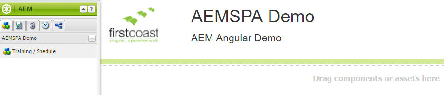
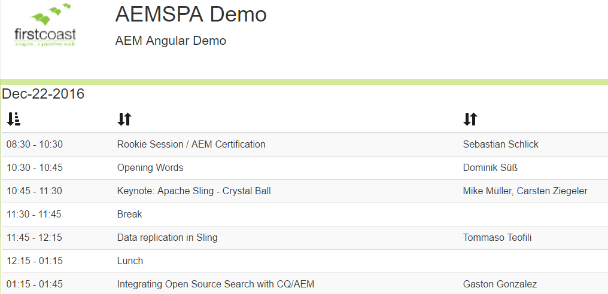

AEM Single Page Application (SPA) using JQuery, Bootstrap Demo
========

This project is a demonstration of how you can build a Single-Page-Application in CQ or Adobe Experience Manager (CQ5, AEM) using Bootstrap and JQuery behaviors and content-generating templates.

Based on an 2014 AdaptTo presentation.

This repository may be found here, https://github.com/dfparker2002/aemspademo.git

Setup
-----

!!!! 
This project uses the NEBA framework (http://neba.io/). 
>> Make sure that you have installed NEBA onto your CQ instance, before you start to play with this project.
Download and install this all-in-one artifact, https://mvnrepository.com/artifact/io.neba/io.neba.neba-delivery-aem/3.11.0
https://mvnrepository.com/artifact/io.neba/io.neba.neba-delivery-aem/3.11.0
!!!! 

CQ 5.6.x - AEM 6.x: Goto http://neba.io/download.html, download the AEM package for NEBA 3.11.0 and install it with Package Manager.

For AEM 6.x+: use Neba.IO 4.10 or better and SpringFramework 4.1x. 

After this you can use the following guide to install the demo project.

Also, check https://github.com/andon/aem-spa-demo/wiki/Project-Setup-with-NEBA

Building
--------

This project uses Maven for building. Common commands:

From the root directory, run `mvn -PautoInstallPackage clean install` to build the bundle and content package and install to a CQ instance.

From the bundle directory, run `mvn -PautoInstallBundle clean install` to build *just* the bundle and install to a CQ instance.

Using with VLT
--------------

To use vlt with this project, first build and install the package to your local CQ instance as described above. Then cd to `content/src/main/content/jcr_root` and run

    vlt --credentials admin:admin checkout -f ../META-INF/vault/filter.xml --force http://localhost:4502/crx

Once the working copy is created, you can use the normal `vlt up` and `vlt ci` commands.

Usage
------------------------
1. Go to http://localhost:4502/content/aemspademo/en.html
2. Using the sidekick, add "Training / Schedule" component

3. Preview mode, test operation. Data page 5 triggers an error. This is intentional.  

  

3a. all data is stubbed, aemspademo\bundle\src\main\java\com\fcrllc\aem\spademo\impl\services\ScheduleService.java 

3b. JavaScript behaviors defined in "apps.spademo" clientlib and individual files found here, content/src/main/content/jcr_root/etc/designs/aemspademo/clientlibs/js/libs 

3c. Table template, content\src\main\content\jcr_root\apps\aemspademo\components\scheduletable\scheduletable.jsp

Class diagram
------------------------
 

Specifying CRX Host/Port
------------------------

The CRX host and port can be specified on the command line with:
mvn -Dcrx.host=otherhost -Dcrx.port=5502 <goals>

References
------------------------
Source presentation: http://www.slideshare.net/netceteragroup/dynamic-components-using-singlepageapplication-concepts-in-aemcq-39532610

Project repo code, https://github.com/dfparker2002/aemspademo.git

http://neba.io/index.html
http://neba.io/2016/09/19/neba-release-3.11.0.html

Compatible with CQ 5.6.x:
https://mvnrepository.com/artifact/io.neba/io.neba.neba-delivery-aem/3.11.0
http://central.maven.org/maven2/io/neba/io.neba.neba-delivery-aem/3.11.0/io.neba.neba-delivery-aem-3.11.0.content-package

TO DO 
=======
- UI unit-tests (hobbes.js)
- Class mocks and junit
- Maven integration automation of reverse map java classes using plugin (generates class diagram above),
https://libraries.io/github/markusmo3/uml-reverse-mapper
https://libraries.io/maven/com.iluwatar:urm-core
https://libraries.io/github/iluwatar/uml-reverse-mapper
